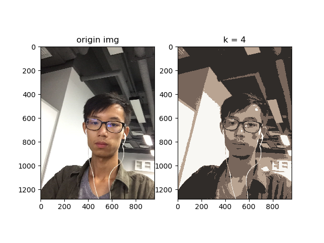
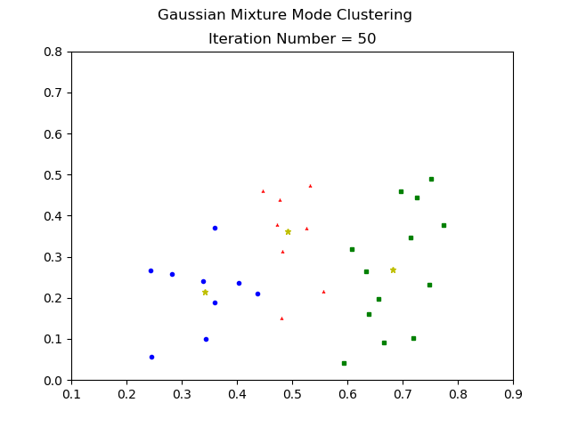

# <center> Lab #2 Clustering </center>

### Exercise 1. mplement 2-D K-means using Python

* Introduction

    k-means clustering is a method of vector quantization, originally from signal processing, that is popular for cluster analysis in data mining. k-means clustering aims to partition n observations into k clusters in which each observation belongs to the cluster with the nearest mean, serving as a prototype of the cluster. 
    

* Procedures
    
    1. Initialize centers $\mu_k$;
    
    2. Cluster every point to their nearest center;
    
    3. update $\mu_k$ using average $\mu_k = \frac{ \sum_n r_{nk}x_n }{\sum_n r_{nk}}$, <br> where 
    $ r_{nk}=\left\{
    \begin{aligned}
    1 &, & \quad point\ n\ belongs\ to\ cluster\ k \\
    0 &, & \quad else
    \end{aligned}
    \right. $
    
    4. repeat from step 1;

* Results

    the mode training dataset is download from [UCI Machine Learning Repository](http://archive.ics.uci.edu/ml/index.php)
    
    
### Exercise 2. Revise your code in Exercise 1 to implement K-medoids

1. the results of k-means and k-medoids is presented above picture.

2. k-means and k-medoids have the almost identical procedures except that updates the new center point. k-means use _**average**_ $\mu_k = \frac{ \sum_n r_{nk}x_n }{\sum_n r_{nk}}$.<br> howerver k-medoids use function $$\mu_k = min_j\sum_{n=1}^N r_{nk}dist(x_n, x_j), \quad for\ j\ in\ size(X)$$ to update the centers.<br>
from the _intuition point of view_, k-medoids will be much 'slower' than k-means because of the _**center update procedure**_ mentioned above.

below is the complexity of the 2 algoritms:

|k-means | k-medoids |
|------- | -------|
|$O(nkt)$ | $O(n^2kt)$|

### *Exercise 3 Image Compression

```python
python ./img_compression_based_on_kmeans.py
```
output image:


### Gaussian Mixture Model (GMM)

I use the dataset table 4.0 in book [机器学习 周志华](https://www.amazon.cn/%E5%9B%BE%E4%B9%A6/dp/B01ARKEV1G) to generate the Gaussian Mixture Model

```python
python ./GMM.py
```

output:
